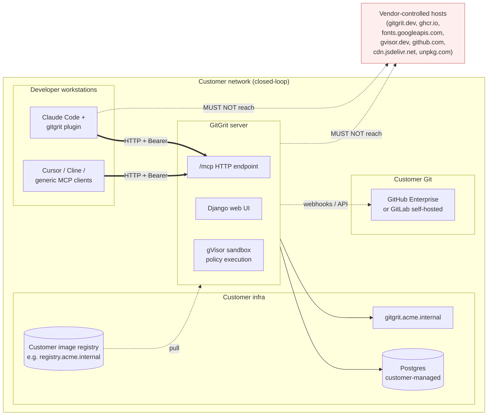

# Closed-Loop Readiness Plan — Server + Plugin

> **Audience.** Whoever is going to retrofit GitGrit so it can be installed inside a customer network with no outbound traffic to vendor-controlled domains.
>
> **Scope.** Both the Django server (`/mcp` endpoint, web UI, sandbox) and the Claude Code plugin (`plugin/`). Excludes commercial concerns (licensing, pricing) — purely structural.
>
> **State of play.** GitGrit is closer to closed-loop-ready than expected: an `AIRGAPPED` env var already gates CDN usage, OAuth is provider-pluggable, there's no telemetry/Sentry/auto-update, Postgres is already external. The remaining gaps are concrete and small in count, but several of them silently leak (Google Fonts, gVisor install) and need explicit fixes before a customer install would work.

---

## Context

A closed-loop ("air-gapped" or "private cloud") customer needs to run GitGrit entirely inside their own network: their VMs or k8s, their image registry, their DNS, their CA, their secrets — and **no outbound calls to vendor-controlled hosts** at runtime, build, or deploy. The customer must also be able to install and configure the Claude Code plugin without GitHub access from developer machines.

Why now: shipping the architecture decisions for this *before* the next round of plugin/server contract changes lets us avoid baking in more vendor coupling. The `AIRGAPPED` flag and `GITLAB_URL` override show the team has already been writing in this direction — this plan finishes the job.

---

## Target deployment shape



**Definition of done.** A customer can:
1. Pull container images from their own registry.
2. Run the server with their own DNS, TLS, secrets, Postgres.
3. Have their developers install the plugin without touching `github.com/kfirzvi-com` or `gitgrit.dev`.
4. Use the web UI without browser requests to `cdn.jsdelivr.net`, `unpkg.com`, or `fonts.googleapis.com`.
5. Update server and plugin from artifacts they control, on their schedule.

---

## What already works

These are existing affordances we should not redesign — the plan builds on top of them:

- **`AIRGAPPED` env var** (`gitgrit/settings.py:34`) → exposed to templates via `app/context_processors.py:8`.
- **Vendored frontend assets** in `app/static/app/vendor/`: `daisyui.css`, `daisyui-themes.css`, `tailwindcss-browser.js`, `htmx.js`, `chart.js`, `codemirror.bundle.js` — gated by `airgapped` in `base.html:137-148` and `dashboard.html:245`.
- **External Postgres** — Kamal accessory was dropped (commit `2f787e5`); `DB_HOST` etc. expected per env (`config/deploy.yml:43-45`).
- **GitLab self-hosted support** — `GITLAB_URL` env var already overrides the SCM base URL (`gitgrit/settings.py:200`, `app/domain/models.py:88-94`).
- **No telemetry / no auto-update / no Sentry** — confirmed across the codebase. Nothing phones home today.
- **`SITE_URL`-driven hosts** — `ALLOWED_HOSTS` and `CSRF_TRUSTED_ORIGINS` are derived from a `SITE_URL` env var (`gitgrit/settings.py:36-38, 161`), so customers already control the domain.
- **OAuth is opt-in** — empty `*_CLIENT_ID` envs disable the provider; the app boots without OAuth.

---

## Audit findings — vendor coupling inventory

### Server / web UI

| # | File:line | What | Severity |
|---|-----------|------|----------|
| S1 | `app/templates/base.html:150-151` | Google Fonts (`fonts.googleapis.com`) loaded **unconditionally**, not behind `airgapped` | **P0** |
| S2 | `app/templates/base.html:138` | Stale `TODO: vendor these locally` comment despite assets already being vendored | P2 |
| S3 | `app/templates/pages/profile.html:196` | Hardcoded `/plugin marketplace add kfirzvi-com/gitgrit` shown in UI | P1 |
| S4 | `app/fixtures/marketplace/policies/gitgrit-badge-in-readme.yaml:31,54` | Badge policy fixture references `gitgrit.dev/badge/` and `app.gitgrit.dev/badge/` | P1 |
| S5 | `site/mkdocs.yml:2` | Docs `site_url: https://gitgrit.dev` — vendor-only, but customer docs may be hosted elsewhere | P2 |
| S6 | `gitgrit/settings.py:186-210` | OAuth providers hardcoded list; **GitHub Enterprise base URL not exposed** (only GitLab via `GITLAB_URL`) | P1 |
| S7 | `app/infrastructure/platform_client.py` (per audit) | Default `api.github.com` / `gitlab.com` set in `PlatformConnection.save()` (`app/domain/models.py:88-94`); customer must override per-connection | P1 |
| S8 | Server | No `instance_name` / branding hooks — every customer's UI says "GitGrit" with vendor brand assets | P2 |

### Plugin

| # | File:line | What | Severity |
|---|-----------|------|----------|
| P1 | `plugin/.claude-plugin/plugin.json:23` | `api_url` default = `https://app-staging.gitgrit.dev/mcp` (overridable, but the default leaks vendor domain) | P1 |
| P2 | `plugin/.claude-plugin/plugin.json:15` | `api_token` description says "from app-staging.gitgrit.dev/settings/tokens" | P1 |
| P3 | `plugin/.claude-plugin/plugin.json:7,9` | `author.url` and `repository` fields hardcode `gitgrit.dev` and `github.com/kfirzvi-com/gitgrit-plugin` | P2 |
| P4 | `plugin/README.md:20,25,26,50` | All install + token instructions hardcode `kfirzvi-com/gitgrit` and `app-staging.gitgrit.dev` | P1 |
| P5 | `plugin/.mcp.json:4` | Transport hardcoded to `"type": "http"` — customers requiring stdio (e.g., for outbound HTTP-blocked dev hosts) have no fallback | P2 |
| P6 | `site/docs/getting-started/setup-cline.md:21`, `setup-cursor.md:23`, `setup-generic.md:19` | All three setup docs hardcode `app-staging.gitgrit.dev/mcp` in config snippets | P1 |
| P7 | `site/docs/getting-started/setup-generic.md:72` | Hardcoded `https://gitgrit.dev/api/setup/cursor/` HTTP fallback URL — no override guidance | P1 |
| P8 | `.claude-plugin/marketplace.json` | Public marketplace install path (`/plugin marketplace add kfirzvi-com/gitgrit`) requires outbound GitHub access; no documented offline install path | **P0** |
| P9 | `plugin/scripts/session-init.sh`, `enforce-check.sh` | **No** outbound calls beyond `git`. ✓ Confirmed clean. | — |
| P10 | `plugin/skills/policy-enforcement/SKILL.md`, all `commands/*.md` | **No** vendor URLs. ✓ Confirmed clean. | — |

### Deployment / distribution

| # | File:line | What | Severity |
|---|-----------|------|----------|
| D1 | `.kamal/hooks/docker-setup:18-21` | gVisor install **requires internet**: `gvisor.dev` (GPG key) + `storage.googleapis.com/gvisor/releases` (deb repo) | **P0** |
| D2 | `Dockerfile:1`, `sandbox_image/Dockerfile:1` | Base image `python:3.13-slim` pulled from Docker Hub at build; `apt` + `pip` need internet at build time | **P0** |
| D3 | `config/deploy.yml:12,32-33` | Hardcoded image `kfirzvi-com/gitgrit` and registry `ghcr.io`; no template for customer registry | **P0** |
| D4 | `.github/workflows/publish.yml:109-121` | `repository_dispatch` to `kfirzvi-com/infra` for deploy — non-portable for customer CI | P1 |
| D5 | `site/docs/` | **No self-hosted / on-prem deployment runbook exists** | **P0** |
| D6 | `.kamal/secrets.<dest>` | No documented list of required vs optional secrets for self-hosted | P1 |
| D7 | `sandbox_image/` | Sandbox image built post-deploy from running app container (`config/deploy.yml:9-10`); doesn't pull externally at runtime ✓ | — |

---

## Adaptation plan

Three priority bands. **Do P0 in order; P1 and P2 in any order after.**

### P0 — Hard blockers (a customer install fails without these)

#### P0-1. Vendor remaining browser assets

`app/templates/base.html:150-151` loads Google Fonts unconditionally. Two fixes, in this order:

1. **Vendor the fonts.** Add `app/static/app/vendor/fonts/` with the DM Sans + JetBrains Mono `.woff2` files and a local `@font-face` CSS block (e.g., `app/static/app/vendor/fonts.css`).
2. **Wrap the existing `<link>` tags in the `airgapped` guard** that already wraps the CDN block above. Drop the stale TODO at `base.html:138` while you're there.

While you're in `base.html`, audit the rest of the file (and every template) for any other unguarded external host. There shouldn't be any besides fonts, but verify with: `grep -rn "https://" app/templates/ | grep -v ""`.

#### P0-2. Air-gapped gVisor install

`.kamal/hooks/docker-setup:18-21` curls upstream packages. Two reasonable paths:

1. **Bake gVisor into a base image.** Build a custom base image (e.g., `gitgrit/base-runsc:python-3.13-slim`) once with gVisor preinstalled, push it to whatever registry the customer uses, and replace the install hook with a no-op. Customers retag and push to their own registry.
2. **Provide an offline install script.** Document and ship a `.kamal/hooks/docker-setup-airgap` variant that pulls the `runsc` binary from a customer-controlled mirror. Selected via env var (`GVISOR_INSTALL_MODE=airgap`).

Path 1 is cleaner for customers; path 2 is faster to implement. Recommend path 1 as the primary, path 2 as a fallback for customers with strict "no third-party base images" rules.

#### P0-3. Image registry parameterization

`config/deploy.yml:12,32-33` hardcodes vendor image and registry. Make these env-driven so a customer can override without forking:

- Replace literal `kfirzvi-com/gitgrit` and `ghcr.io` with `${IMAGE_REPO}` / `${IMAGE_REGISTRY}` references resolved at deploy time (Kamal supports env interpolation in YAML).
- Document a "retag and push" workflow (`docker pull → docker tag → docker push <customer-registry>`) in the new self-host runbook.
- Add a `config/deploy.example.yml` that the customer copies and fills in.

#### P0-4. Self-hosted deployment runbook

There's no runbook today. Add `site/docs/deploy/self-hosted.md` covering:

1. Required infra (Linux VM with Docker, Postgres, internal DNS, TLS cert).
2. Required env vars (with `required vs optional` table — see P1-7).
3. Image pull / retag instructions.
4. Kamal commands (`kamal setup`, `kamal deploy`) with destination-file template.
5. Sandbox bring-up + verification.
6. Plugin install pointing at the customer's own server.
7. Smoke test: hit `/mcp` with an issued token and call `list_projects`.

#### P0-5. Plugin offline install path

**Design principle:** the public-cloud install stays the simplest possible — `/plugin marketplace add kfirzvi-com/gitgrit` → `/plugin install gitgrit@gitgrit` → defaults Just Work. Don't degrade that to accommodate closed-loop. Add a *second* path for customers who can't reach `github.com/kfirzvi-com`, don't replace the first.

The closed-loop path is **internal git mirror**, which uses Claude Code's existing marketplace mechanism — no new server code:

1. Customer admin mirrors the plugin once into their internal git host (e.g., `https://git.acme.internal/platform/gitgrit-plugin`). They re-pull and re-tag from upstream on whatever cadence they want.
2. Developers install via:
   ```
   /plugin marketplace add https://git.acme.internal/platform/gitgrit-plugin.git#v0.3.0
   /plugin install gitgrit@gitgrit
   ```
3. Same prompts, same defaults the public path uses — except the customer enters their own `api_url` and `api_token` at install time.

**Documentation work (no code changes):**
- A "Self-hosted install" section in `plugin/README.md` covering the mirror setup and the install command.
- A short admin-side "How to mirror the plugin" subsection in the self-hosted runbook (P0-4).
- A "shared filesystem path" fallback (`/plugin marketplace add /mnt/platform/gitgrit-plugin`) for customers without an internal git host.

**What's explicitly NOT in this plan:**
- ~~Server-hosted tarball download endpoint at `/plugin/download/<version>/`.~~ Considered and dropped — adds Django routes, a build pipeline, version-registry logic, and a new auth surface for marginal benefit. Customers who run closed-loop GitGrit almost always have an internal git host or artifact repo already; we should let them use it rather than build a new distribution channel. Revisit only if a real customer asks for it.

### P1 — Customer-experience and security polish

#### P1-1. Plugin defaults: keep the public path easy, document the override

**Don't break the easy path.** The public-cloud user runs two slash commands and accepts the default `api_url` without thinking. Removing the default would add a paste-step for every normal install just to clean up vendor strings — wrong trade.

What to actually change:

- `plugin/.claude-plugin/plugin.json:23` — point the `api_url` default at the **production** GitGrit URL (`https://app.gitgrit.dev/mcp`), not staging. Today it's `app-staging.gitgrit.dev/mcp`, which would silently send public-cloud users to staging. (Confirm prod URL before changing; if prod isn't live yet, leave staging until it is.)
- `plugin/.claude-plugin/plugin.json:15` — rewrite the `api_token` `description` so it works for both audiences: `"Workspace API token. Public cloud: app.gitgrit.dev/settings/tokens. Self-hosted: your GitGrit server's Profile → API Tokens & MCP page."` Mentions the public URL (so normal users know where to go) but tells closed-loop users they substitute their own.
- `plugin/.claude-plugin/plugin.json:7,9` — `author.url` and `repository` can stay as-is (`gitgrit.dev`, `github.com/kfirzvi-com/gitgrit-plugin`); they're metadata about the publisher, not where the customer's instance lives. Closed-loop customers reading these fields aren't confused by them.

#### P1-2. Setup docs: parameterize the MCP URL

`site/docs/getting-started/setup-cline.md:21`, `setup-cursor.md:23`, `setup-generic.md:19,72` all hardcode `app-staging.gitgrit.dev`. Two-step fix:

- Replace literals with a placeholder like `https://<your-gitgrit>/mcp` and add a note explaining that customers running their own deployment substitute their domain.
- For `setup-generic.md:72` (`https://gitgrit.dev/api/setup/cursor/`), make this a templated example and explain the `/api/setup/{client}` shape so customers know it's their server.

#### P1-3. Server-rendered marketplace command

`app/templates/pages/profile.html:196` shows the literal `/plugin marketplace add kfirzvi-com/gitgrit`. Drive this from settings — e.g., a `PLUGIN_MARKETPLACE_SOURCE` env var the customer sets to their internal git URL or local-path install command. Default to the vendor string for the public-hosted product.

#### P1-4. Badge policy fixture

`app/fixtures/marketplace/policies/gitgrit-badge-in-readme.yaml:31,54` references `gitgrit.dev/badge/`. Either:
- Templatize the badge URL with `{{ SITE_URL }}` substitution at fixture-load time, or
- Mark this policy "vendor-hosted only" and exclude from the default fixture set installed on customer instances.

#### P1-5. GitHub Enterprise URL

`gitgrit/settings.py:186-210` exposes `GITLAB_URL` but no equivalent `GITHUB_ENTERPRISE_URL`. Add it, wire it through `PlatformConnection.save()` in `app/domain/models.py:88-94`, and through the GitHub OAuth provider config.

#### P1-6. CI/CD portability

`.github/workflows/publish.yml:109-121` `repository_dispatch`-es to `kfirzvi-com/infra`. For customer self-hosted CI, document the alternative: replace the dispatch step with `kamal deploy -d <dest>` invoked directly. Provide a `.github/workflows/deploy-template.yml` example that customers can copy.

#### P1-7. Secrets documentation

Generate a single table — required vs optional secrets — and put it in the self-host runbook (P0-4). Source of truth: `config/deploy.yml:47-55`. Mark `SECRET_KEY`, `DB_*`, `SITE_URL` as required; OAuth client IDs/secrets, `SENTRY_DSN` (if added), `GITHUB_ENTERPRISE_URL`, `GITLAB_URL` as optional.

### P2 — Polish / nice-to-have

- **P2-1.** Drop stale TODO at `base.html:138`.
- **P2-2.** Remove or templatize `site/mkdocs.yml:2` `site_url`.
- **P2-3.** Add a stdio MCP transport option for plugin (`plugin/.mcp.json`) for customers whose Claude Code installs can't reach internal HTTPS reliably. Server already supports streamable HTTP; stdio would require running a local process — non-trivial, defer until a customer asks.
- **P2-4.** Add an `INSTANCE_NAME` / branding hook so the customer's UI can say "Acme Compliance" instead of "GitGrit" (low cost: settings + a couple of templates).
- **P2-5.** Bake an "installed plugin version" check into the server (`/mcp/server-info` resource) so customers can verify plugin/server compatibility without phoning home.

---

## Architectural decisions worth making explicit

These come out of the audit and should be written down somewhere visible (probably the new self-host runbook):

1. **The plugin is a thin client.** All policy logic, all enforcement decisions, all data live on the server. The plugin's job is to detect repo state, hand it to the server, and present the response. This means: **no plugin-side caching of policies**, no offline mode, no client-side rule evaluation. Customers running closed-loop need a healthy server; the plugin alone has no fallback.

2. **The MCP contract is the public API.** The tool names and signatures (`session_bootstrap`, `validate_edit`, etc.) are baked into the plugin scripts. Renaming a tool is a breaking change for customers running pinned plugin versions. **Add tool-name stability commitments** before customers depend on this.

3. **One server per environment.** Customers should run separate instances for staging vs prod, each with its own DB, tokens, and plugin install (the plugin's per-install `userConfig` isolation supports this — see the dev-marketplace work in `plugin-flow.md`).

4. **Postgres is the only required state.** No Redis, no S3, no message queue. Keep it that way; resist adding stateful infra dependencies that would multiply the customer's deploy burden.

---

## Verification

A customer install is closed-loop-ready when **all** of the following pass:

### Network egress check (server)
```bash
# After deploy, from the server VM
sudo iptables -A OUTPUT -d 0.0.0.0/0 -j REJECT  # block all egress
# Hit the web UI in a browser, make a policy edit, run a sandbox test.
# Expect: zero failures, no 5xx, no broken images, no console errors.
```

### Network egress check (browser)
With browser DevTools → Network tab open, exercise the dashboard, profile, policy editor, and policy run views. Filter by domain. **Expect zero requests** to: `gitgrit.dev`, `cdn.jsdelivr.net`, `unpkg.com`, `fonts.googleapis.com`, `fonts.gstatic.com`, `ghcr.io`.

### Network egress check (plugin)
With `tcpdump` or a host firewall on the developer machine, install the plugin from a local path and run a session. **Expect zero outbound packets** except to the customer's GitGrit server hostname and to GitHub Enterprise / GitLab self-hosted (if configured for the project).

### Build-time check
```bash
# Build images on a host with internet, then disconnect and try a fresh deploy
docker build -t myorg/gitgrit:test .
docker save myorg/gitgrit:test > /tmp/img.tar
# Disconnect, on target host:
docker load < /tmp/img.tar
kamal deploy -d offline
```
**Expect:** deploy succeeds, including gVisor sandbox bring-up.

### Smoke test (existing tooling)
- `scripts/mcp_smoke_test.py` against the customer's `/mcp` URL with a customer-issued token. Confirm `list_projects`, `session_bootstrap`, `validate_edit` all return 200.

### Plugin install test
- Install plugin via `/plugin marketplace add /opt/gitgrit-plugin` (no GitHub).
- Configure with customer's `api_url` + `api_token`.
- Run `/gitgrit-status` and `/gitgrit-check`. Confirm both succeed.

---

## Out of scope (intentionally)

- License enforcement / activation keys.
- Customer-side audit logging or SIEM integration (their problem; we just need to not block it).
- Multi-region HA. Closed-loop ≠ highly available; treat them as separate concerns.
- Source-code escrow / "give the customer the code." Different conversation.
- Hardening review (CSP, secret-rotation, RBAC) — deserves its own audit; flagged separately.

---

## Suggested rollout

1. **Week 1:** P0-1 (fonts), P0-2 (gVisor base image), P0-3 (registry env vars), P0-4 stub (start the runbook), P0-5 (offline plugin install + tarball download endpoint).
2. **Week 2:** P0-4 finish (full runbook with screenshots), P1-1, P1-2, P1-3 (UI vendor strings), P1-7 (secrets table).
3. **Later:** P1-4 (badge fixture), P1-5 (GHE URL), P1-6 (CI portability), all P2.

A dry-run customer install at the end of week 1 (using a clean VM with egress blocked) is the cheapest way to find things this audit missed.
