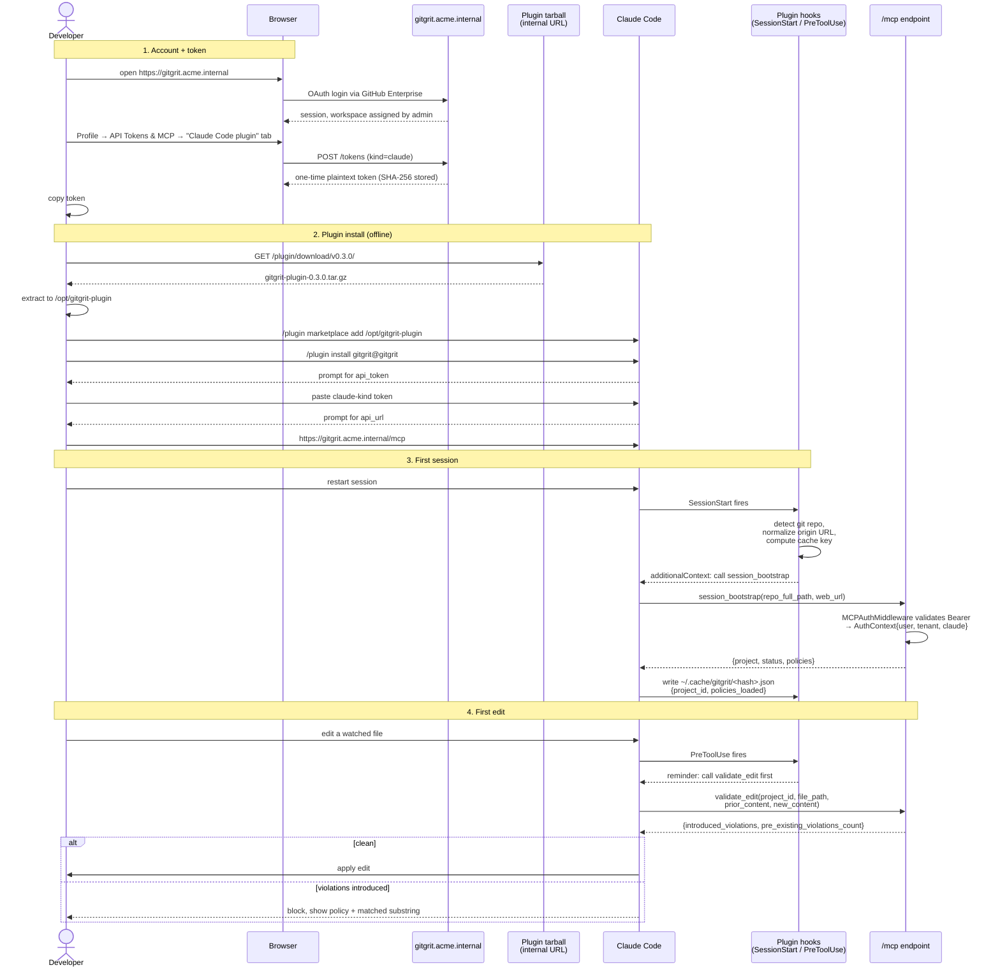
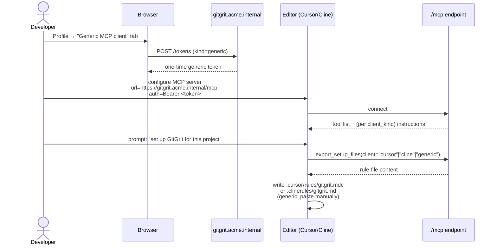

# New-User Connection Flow

> **Companion to** `closed-loop-readiness.md` (target architecture) and `plugin-flow.md` (runtime flow). This doc walks one developer through getting connected on day one — public cloud and closed-loop, both.
>
> **Two tracks, kept separate.** Most users hit the public path; that path stays as light as possible. Closed-loop is a documented alternative for customers who deploy GitGrit inside their network.

Running example for the closed-loop track: customer is **Acme Corp**, their GitGrit instance is at `https://gitgrit.acme.internal`, their internal git is `https://git.acme.internal` (GitHub Enterprise).

---

## Track A — Public cloud (the easy path)

This is what a normal user does. Two slash commands, the rest is prompts.

```
/plugin marketplace add kfirzvi-com/gitgrit
/plugin install gitgrit@gitgrit
```

Claude Code then prompts for:

1. `api_token` — paste a token generated at `https://app.gitgrit.dev/settings/tokens` → "Claude Code plugin" tab.
2. `api_url` — accept the default (`https://app.gitgrit.dev/mcp` after P1-1 ships; `https://app-staging.gitgrit.dev/mcp` until then).

Restart the session. The first time SessionStart fires, the plugin bootstraps the project and starts enforcing edits. Done.

**Total user effort:** two commands + one paste + one Enter. The flow detail in the rest of this doc is the same machinery, but on a customer-controlled host and with one extra setup step (pointing at the right URL).

---

## Track B — Closed-loop (customer-hosted)

---

## Roles

| Role | Who | Responsibility |
|---|---|---|
| **Admin** | Acme platform/devops team | Deploys server, configures OAuth, creates workspace, hosts plugin tarball |
| **Developer** | New user (this flow) | Gets an account, installs the plugin, edits code |
| **Server** | `gitgrit.acme.internal` | Mints tokens, serves `/mcp`, runs sandbox |
| **Editor** | Claude Code (or Cursor / Cline / generic MCP client) | Hosts the plugin, sends edits |

---

## End-to-end flow (Claude Code path)



---

## Stage detail

### 1. Account + token

**1a. Account.** Admin has either pre-created the developer's account in the workspace, or OAuth on first login auto-provisions and the admin approves the membership. OAuth provider must be configured for the customer's identity source — for Acme, that's GitHub Enterprise via `GITHUB_CLIENT_ID` + `GITHUB_ENTERPRISE_URL` (the latter is **P1-5** in the closed-loop plan; until that ships, customers using GHE have to fall back to GitLab self-hosted or local-auth-only).

**1b. Token kind.** The Profile page exposes two tabs:
- **Claude Code plugin** → `client_kind="claude"` token. Embeds in `plugin/.mcp.json` via Claude Code's `userConfig`. Bound to a single user.
- **Generic MCP client** → `client_kind="generic"` token. For Cursor, Cline, MCP Inspector, custom IDEs.

The two kinds drive different server behavior — the server's `export_setup_files()` tool only works for generic-kind tokens (claude-kind clients get instructions via plugin hooks instead). **Mismatching token kind to client = 401.**

**1c. Token storage.** Token is shown **once** in plaintext, then stored only as a SHA-256 hash on the `APIToken` row (per `app/application/api_token_service.py:8`). Lost token = revoke + reissue.

### 2. Plugin install (closed-loop)

Public-cloud uses `/plugin marketplace add kfirzvi-com/gitgrit`, which requires reaching `github.com`. Closed-loop developers can't, so they install from a mirror inside the customer network.

**2a. Internal git mirror (recommended).**

Admin one-time setup: pull the plugin from upstream, push to internal git.
```bash
# On a host with outbound access:
git clone https://github.com/kfirzvi-com/gitgrit.git
cd gitgrit
git remote add internal https://git.acme.internal/platform/gitgrit-plugin.git
git push internal --tags
```

Developer install:
```
/plugin marketplace add https://git.acme.internal/platform/gitgrit-plugin.git#v0.3.0
/plugin install gitgrit@gitgrit
```

Same UX as the public path; only the host changed. Versioning via tags. No new server-side machinery.

**2b. Shared filesystem path (fallback).**

For customers without an internal git host:
```
/plugin marketplace add /mnt/platform/gitgrit-plugin
/plugin install gitgrit@gitgrit
```
Admin extracts the plugin to a mount visible from dev workstations.

**2c. Configuration prompts.** Same prompts as the public path. The user pastes their **customer-issued** `api_token` and overrides the `api_url` default with their internal URL (`https://gitgrit.acme.internal/mcp`). After P1-1 the description text spells out both options ("Public cloud: …; Self-hosted: …"), so closed-loop users know to substitute.

### 3. First session (bootstrap)

Identical to the public-cloud flow described in `plugin-flow.md` §2 — the only difference is which host the MCP traffic goes to. Three resolution outcomes:

- **`no_match`** — repo's git origin doesn't match any project in the workspace. Cache file written with `policies_loaded=false`. Enforcement disabled. **Likely cause:** the project hasn't been connected in the GitGrit web UI yet — admin or developer needs to create the project + connection there first.
- **Project found, no policies** — project exists but has no active policies attached. `policies_loaded=false`. Enforcement disabled. Quiet — no violations to show.
- **Project + policies** — `policies_loaded=true`. HARD RULE injected (only enforce rules in `policies[i].rules`). Enforcement active for the rest of the session.

The cache file lives at `$XDG_CACHE_HOME/gitgrit/<hash>.json` and is keyed by SHA-256 of the absolute `.git` path. **One cache file per repo clone**, not per workspace — different clones of the same repo bootstrap independently.

### 4. First edit (enforcement)

When the developer asks Claude to edit a file, PreToolUse fires `enforce-check.sh`, which reads the cache and emits a reminder if `policies_loaded=true`. Claude then calls `validate_edit(project_id, file_path, prior_content, new_content)`. Server response:
- `introduced_violations: []` → clean edit, Claude applies it.
- `introduced_violations: [{policy, matched_substring, suggested_fix}, ...]` → Claude blocks, shows the violations, asks the developer for confirmation.
- `pre_existing_violations_count: N` → informational only. Doesn't block.

The `policy-enforcement` skill (`plugin/skills/policy-enforcement/SKILL.md`) is the contract for how Claude interprets that response.

---

## Generic MCP client path (Cursor / Cline / Inspector)

Different track because there's no plugin and no SessionStart hook. Three steps:



Differences from the Claude Code path:
- **Token kind = generic.** A claude-kind token returns 401 here.
- **No SessionStart hook** — instead, the rule file (Cursor/Cline) or system-message paste (generic) carries the same instructions.
- **No PreToolUse hook** — enforcement happens because the rule file tells the model to call `validate_edit` before every edit, not because a hook reminds it.
- **`export_setup_files()` is the bootstrap** — it returns the rule-file content the server thinks each client should be running. After P1-2 this URL is no longer hardcoded to `gitgrit.dev`.

The MCP URL itself is still configured per-editor (Cursor's `~/.cursor/mcp.json`, Cline's settings panel, etc.). After P1-2, the setup docs at `site/docs/getting-started/setup-{cline,cursor,generic}.md` use `https://<your-gitgrit>/mcp` placeholders instead of `app-staging.gitgrit.dev`.

---

## Failure modes (what new users will trip over)

| Symptom | Root cause | Fix |
|---|---|---|
| `401 Unauthorized` on first MCP call | Wrong token kind (claude in generic client, or vice versa) | Reissue with the correct kind |
| `401 Unauthorized` after working previously | Token revoked, or workspace membership removed | Reissue token; check membership in admin UI |
| Connection refused / TLS error | `api_url` typo, or customer cert not trusted by Claude Code | Verify URL; install customer CA on the dev workstation |
| `session_bootstrap` returns `no_match` | Repo not connected to a project, OR origin URL doesn't match what the project has | Connect the repo via the web UI; check the project's `web_url` matches `git remote get-url origin` |
| Hook runs but Claude doesn't call `validate_edit` | Cache file missing — bootstrap probably failed silently mid-session | Run `/gitgrit-refresh` to reset; if persistent, check `~/.cache/gitgrit/` permissions |
| Edits aren't blocked even with policies loaded | Pre-existing violations show but introduced ones don't — likely a policy rule mismatch, or `policies_loaded=false` in cache | Open the cache file; verify `policies_loaded=true`; run `/gitgrit-status` |
| `/plugin marketplace add` fails | Network rules block dev workstation from reaching the tarball URL or git mirror | Have admin verify dev → server connectivity; download tarball out-of-band and `scp` if needed |

These are the ones the onboarding doc P0-4 (admin runbook) and the plugin docs (after P1-2) should explicitly call out.

---

## What needs to ship before the closed-loop track works end-to-end

The public track (Track A) works today. The closed-loop track (Track B) has these dependencies:

| Step | Depends on |
|---|---|
| Stage 1 (account via GHE OAuth) | **P1-5** — `GITHUB_ENTERPRISE_URL` env var |
| Stage 2a (internal git mirror install) | **P0-5** — docs in `plugin/README.md` + admin runbook describing the mirror setup. No code changes. |
| Stage 2c (token description mentions self-hosted) | **P1-1** — `plugin.json` description rewrite to cover both audiences |
| Generic-client setup-doc URLs | **P1-2** — placeholders in `setup-*.md` |
| Profile page marketplace command | **P1-3** — `PLUGIN_MARKETPLACE_SOURCE` setting (so the UI shows the right install command for each instance) |

Until these land, closed-loop developers can still install — they just have to figure out the mirror setup from this doc and ignore the misleading staging URL in the prompt description.

---

## Verification a developer can run themselves

After completing the four stages, a developer can confirm everything is wired up by running:

```
/gitgrit-status
```

Expected: a workspace name, a project name matching their repo, a compliance grade, and a list of top offending policies (or "no violations"). Failure here means stage 3 didn't fully complete — the cache file is the place to start debugging.

```
/gitgrit-check
```

Expected: walks `git diff HEAD --name-only`, runs `validate_edit` per file, reports either "no violations introduced" or a per-file violation list. Failure here without `/gitgrit-status` failing means PreToolUse + skill wiring is fine but `validate_edit` is rejecting the request — usually a stale cache or a server-side project mismatch.

If both pass, enforcement is fully active for this developer in this repo.
