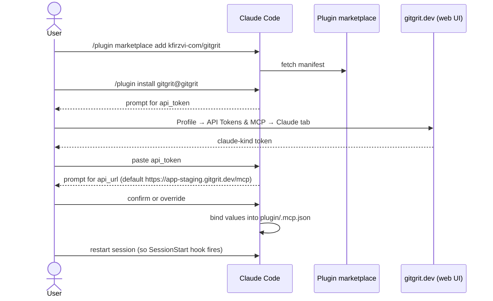
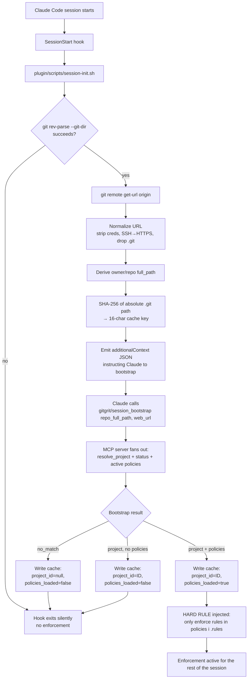
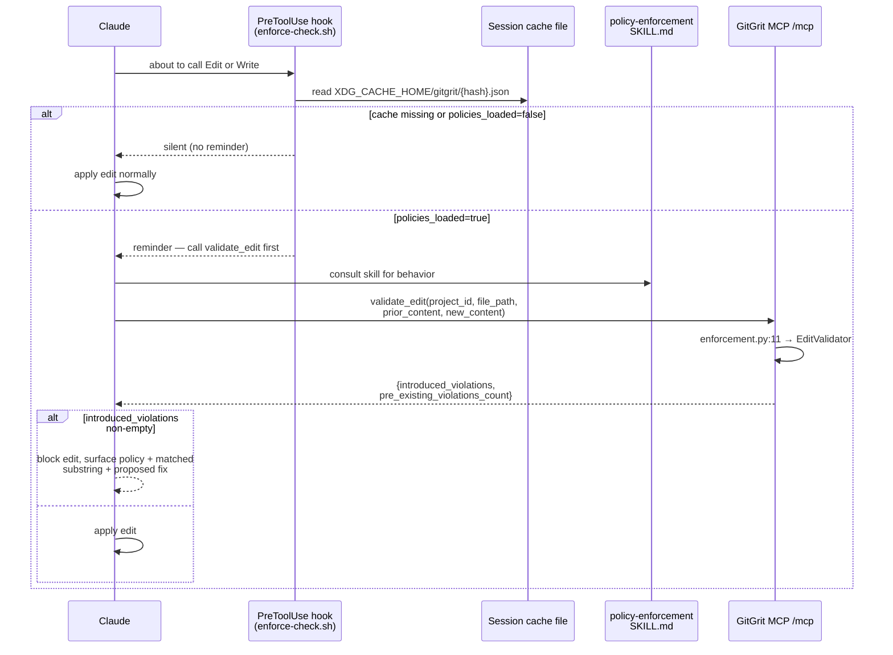
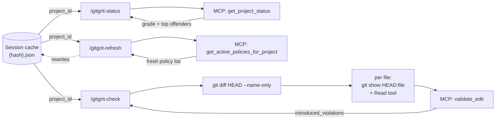
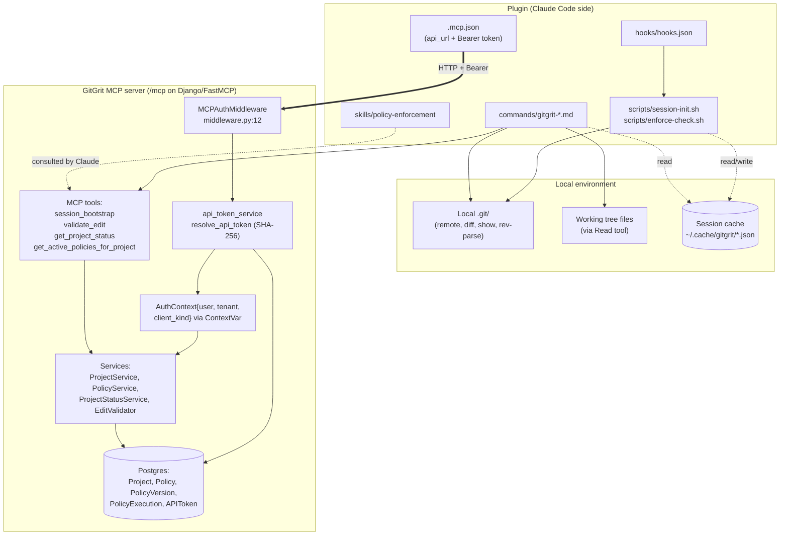

# GitGrit Plugin — Current State Flowchart

> **Purpose.** Map the GitGrit Claude Code plugin (`plugin/`) end-to-end so we can see how install, runtime, and data flows fit together. The plugin grew incrementally; this doc exists to support a future restructure by making the current shape inspectable in one place. **Descriptive, not prescriptive.**

The plugin is a three-stage system glued together by a session-state cache file:

1. **SessionStart** — detect the repo, bootstrap project + policies, write a per-clone cache file.
2. **PreToolUse** — before every `Edit`/`Write`, remind Claude to call `validate_edit`.
3. **Slash commands** — `/gitgrit-status`, `/gitgrit-refresh`, `/gitgrit-check` for explicit queries.

All plugin → server traffic is **MCP over HTTP** with a Bearer token. There are no REST calls from the plugin.

---

## 1. Install flow

**Files**
- `plugin/.claude-plugin/plugin.json` — manifest (name, version, user_config schema)
- `plugin/.mcp.json` — MCP server entry (`type: http`, URL = `${user_config.api_url}`, `Authorization: Bearer ${user_config.api_token}`)
- `plugin/README.md` — install instructions

---

## 2. Session bootstrap

**Files**
- `plugin/scripts/session-init.sh` — bash + Python hybrid; no network calls
- `plugin/hooks/hooks.json` — wires SessionStart → script
- Server: `app/infrastructure/mcp/tools/project_status.py:73` (`session_bootstrap`)
- Cache file: `$XDG_CACHE_HOME/gitgrit/<hash>.json` — schema `{version: 2, project_id, project_name, policies_loaded}`

---

## 3. Edit-time enforcement

**Files**
- `plugin/scripts/enforce-check.sh` — reads cache, emits reminder if policies loaded
- `plugin/skills/policy-enforcement/SKILL.md` — defines how Claude interprets `validate_edit` (block on `introduced_violations`, treat `pre_existing_violations_count` as informational)
- Server: `app/infrastructure/mcp/tools/enforcement.py:11` (`validate_edit`)

---

## 4. Slash commands

**Files**
- `plugin/commands/gitgrit-status.md` — compliance grade + top offending policies
- `plugin/commands/gitgrit-refresh.md` — refetches policies; line 13 explicitly forbids satisfying from cached bootstrap data
- `plugin/commands/gitgrit-check.md` — iterates modified files, calls `validate_edit` per file

---

## 5. Data sources & connections

**Auth path.** Token from `.mcp.json` → `MCPAuthMiddleware` (`app/infrastructure/mcp/middleware.py:12`) → `resolve_api_token` SHA-256 lookup (`app/application/api_token_service.py:8`) → `AuthContext{user, tenant, client_kind}` stashed in a `ContextVar` → every service-layer call filters by `tenant`. `client_kind` distinguishes `"claude"` (this plugin) from `"generic"` (Cursor, Cline, MCP Inspector).

**Tools list (server-side).** Beyond the four the plugin uses, the server also exposes `list_projects`, `list_policies`, `get_policy`, `create_policy`, `update_policy`, `delete_policy`, `set_policy_code`, `resolve_project`, `get_project_context_api`, `run_policy_test`, and `export_setup_files` — used by the web UI and other clients but not invoked by the plugin itself.

---

## Observations

Surface area worth noting when planning a restructure (descriptive only):

- **Cache file is written by the model, read by bash.** The SessionStart hook tells Claude (in `additionalContext`) to call the `Write` tool to persist `{project_id, policies_loaded}`. Bash hooks then read that file. If the model skips or fails the write, PreToolUse silently sees no policies and enforcement disables — no surfaced error.
- **Two paths produce `validate_edit` calls.** PreToolUse emits a reminder for ad-hoc Edits; `/gitgrit-check` walks the diff and calls it per file. The control flow, the prompt wording, and the failure handling differ between the two paths.
- **HARD RULE text is duplicated.** "Only enforce rules that literally appear in `policies[i].rules`" lives in both `plugin/scripts/session-init.sh` (injected as `additionalContext`) and `plugin/skills/policy-enforcement/SKILL.md`. They must be edited together.
- **Cache schema versioning is in the file.** `enforce-check.sh` checks `version: 2` to decide whether to enforce. A schema bump requires plugin-side migration logic; there's no server-side `/session/status` to query instead.
- **Deprecated tools still exposed.** `resolve_project`, `get_project_status`, and `get_active_policies_for_project` are flagged deprecated in favor of `session_bootstrap` (in docstrings), but generic clients can still call them. `/gitgrit-status` and `/gitgrit-refresh` use the deprecated ones intentionally — they want the narrow data, not the bootstrap fan-out.
- **No automatic policy refresh mid-session.** Bootstrap runs once; `/gitgrit-refresh` is the only way to pick up server-side policy changes during a session.

---

## How to verify this doc

- Open this file on GitHub or in VS Code with a Mermaid extension → all five diagrams should render.
- Spot-check the file/line references against the repo (the references are tagged inline so future drift is visible).
- Read it cold: a teammate who has never touched the plugin should be able to explain in 60 seconds (a) what happens on session start, (b) what fires on every Edit, and (c) where the plugin pulls data from.
